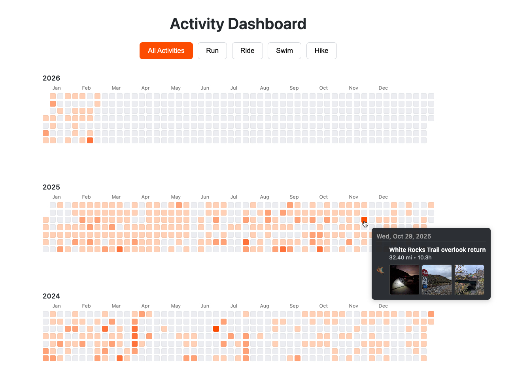

# Strava Activity Dashboard

A high-performance, interactive dashboard for visualizing Strava activity data using Google Sheets and Google Apps Script. 

## Overview
This project transforms a flat list of Strava activities into a rich, GitHub-style heatmap visualization. It's designed to provide a comprehensive look at activity patterns across multiple years, with deep-dive capabilities into individual efforts.

## Key Features
- **Interactive Heatmap**: Visualizes activity intensity (moving time) across years, months, and days.
- **Rich Tooltips**: Hover over any day to see:
    - Activity type icon (🏃, 🚴, 🏊, etc.)
    - Activity name, distance, and duration.
    - **Thumbnail Gallery**: Up to 3 photos from each activity displayed directly in the tooltip.
- **Clickable Cells**: Each heatmap cell is a link. Clicking a cell opens all Strava activity URLs for that day in new browser tabs.
- **Dynamic Filters**: Quick-toggle between all activities or specific types like Run, Ride, Swim, and Hike.
- **Hand Cursor Indicator**: Interactive data points show a hand cursor on hover for better UX.

## Development Note
This project was built and debugged using [**Google Antigravity**](https://antigravity.google/), an agentic AI coding assistant. Antigravity wrote all the code, from initial heatmap logic to complex rich tooltips and thumbnail integration.

### Automation & Deployment
A specialized **Project Ops** skill has been implemented for this repository. It enables synchronized deployments to both GitHub and Google Apps Script using a single command:
- **Command**: `/deploy`
- **Logic**: Automatically stages files, prompts for a commit message, pushes to GitHub, and runs `clasp push` to update the GAS environment.

## Tech Stack
- **Backend**: Google Apps Script (GAS)
- **Frontend**: HTML5, Vanilla CSS, JavaScript
- **Data Source**: Google Sheets (Synced via Strava API)

## How it Works
1. **Data Syncing**: Activity data is synced from Strava to a Google Sheet.
2. **GAS API**: A server-side script fetches and parses this data into JSON.
3. **Frontend Rendering**: The client-side script builds the multi-year heatmap grid and handles all user interactions (filters, tooltips, clicks).
